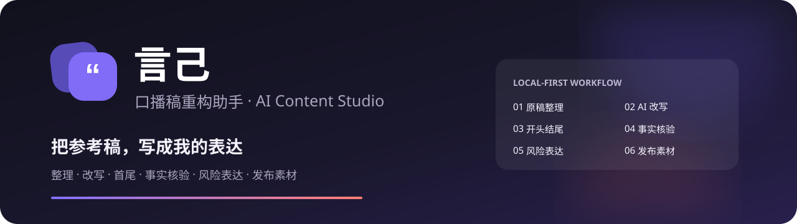
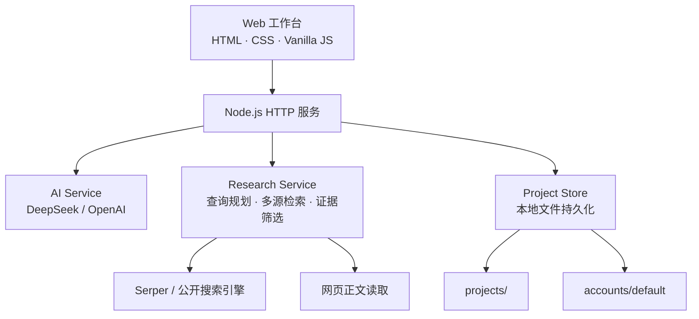

<p align="center">
  
</p>

<p align="center">
  
  
  
  
  
</p>

<p align="center">
  一个面向中文口播创作的本地 AI 工作台。<br />
  从原稿整理、深度改写到事实核验和发布包装，每一步都能看、能改、能追溯。
</p>

---

## 为什么做「言己」

这个项目起源于我自己的短视频创作流程。

我的账号叫 **「竹安爱生活」**，全网约 2 万粉丝，其中视频号粉丝 1 万+，也是视频号金标科普博主。日常创作中，我经常会看到别人讲了一个很好的话题：它有信息量、有传播价值，也值得继续讲。但“发现一个好话题”和“做出一条可以放心发布的内容”，中间还有很长一段路。

首先，别人的稿件不能直接照搬。我要保留话题价值，重新组织结构、叙事和表达，把它真正写成自己的口吻，而不是简单替换几个同义词。

其次，参考内容里的说法未必都是真的。人物原话有没有出处？历史细节是否准确？数据和因果关系能不能成立？作为科普创作者，内容可以有节奏、有观点，但事实必须尽可能严谨。仅仅“改得不像原文”还不够，还需要逐条识别存疑陈述、搜索来源、阅读正文，再决定保留、弱化还是替换。

稿件完成后，工作也没有结束。还要检查平台违禁词和高风险表达，生成标题、视频描述、Tag、评论区互动留言，并把最终正文整理成可以直接录制和发布的版本。

这些事情每篇稿子都要重复：

> 找到话题 → 整理原稿 → 重构表达 → 修改首尾 → 核验事实 → 审查风险 → 准备发布素材

它们不是一次灵感，而是一套稳定、重复、容易遗漏的工程流程。我不想每次都从头告诉 AI 应该怎么做，也不想让它忘记我已经确认过的写作习惯，所以把这套流程做成了固定工作台，并让它能够保存项目上下文和经过我确认的长期偏好。

这就是 **「言己」**：不是一个“一键改写”的输入框，也不是用 AI 批量复制别人的内容，而是一个属于创作者自己的短视频工作台。AI 负责执行重复工作，创作者保留判断、选择和最终决定。

它最初服务于「竹安爱生活」，也希望能帮助其他有改稿、核验、审查和发布包装需求的短视频创作者，把反复劳动沉淀成自己的内容生产系统。

## 核心能力

| 能力 | 说明 |
| --- | --- |
| 六步可视化工作流 | 原稿整理、AI 改写、开头结尾、事实核验、风险表达、发布素材 |
| 真实 AI 进度 | 流式显示服务端当前处理阶段、百分比和耗时，支持重新生成 |
| 双栏对照编辑 | 原稿与整理稿、整理稿与改写稿并排阅读，支持跟随滚动和拖动分栏 |
| 选区 AI 共写 | 框选任意文字后发起局部改写，先预览，再采用、重试或撤回 |
| 按需事实核验 | AI 先标记候选事实；只有用户点击后才搜索，也可手动框选句子校验 |
| 研究式网页搜索 | 多角度生成检索词，读取网页正文，区分证据、正文相关来源和搜索线索 |
| 风险表达独立检查 | 事实核验与平台风险分开，逐条选择保留或接受替换 |
| 发布素材整包交付 | 完整正文、标题、描述、标签、互动话术和易错读音集中展示与复制 |
| 项目级上下文 | 保存本篇对话、选区会话、生成任务、核验记录和每一步选择 |
| 账号长期记忆 | 由用户确认后沉淀写作偏好，并注入后续每一次 AI 生成 |

## 工作流


### 1. 原稿整理

填写原标题、来源平台、作者和链接，也可以只粘贴原文。AI 仅修正错字、语音转写、标点和断句，并整理成适合口播的大段落。

### 2. AI 改写

按账号风格重组结构与表达，支持设置目标字数。服务端会自动校准，最终字数与目标相差不超过 100 字。

### 3. 开头结尾

生成多个开头和结尾方向，由用户分别选择后组成完整稿。旧内容会保留划线记录，方便回看替换前后。

### 4. 事实核验

AI 第一遍只识别可能需要验证的句子，不联网、不下结论。点击“开始校验”后才会：

1. 把复合说法拆成独立事实；
2. 从直接关系、权威来源、争议与反例等角度搜索；
3. 读取候选网页正文；
4. 区分支持、反驳、证据不足和仅供继续查找的线索。

没有被 AI 标黄的句子，也可以手动框选后点击“校验所选句”。

### 5. 风险表达

单独检查歧视、煽动对立、危险行为、医疗或商业承诺、低俗表达及绝对化说法，不与事实搜索混在一起。

### 6. 发布素材

集中展示最终正文、标题、视频描述、标签、评论区互动话术和易读错字词。可以继续修改正文，也可以一键复制完整发布方案。

## 快速开始

### 环境要求

- Node.js 20 或更高版本
- DeepSeek 或 OpenAI API Key（二选一）
- Serper API Key（可选，用于更稳定的 Google 搜索结果）

### 启动

```bash
git clone https://github.com/zhongshiyu0129/yanji-media-assistant.git
cd yanji-media-assistant
cp .env.example .env.local   # 可选，也可以在网页中填写 Key
npm start
```

打开 [http://127.0.0.1:4173](http://127.0.0.1:4173)。

开发模式会在服务端文件变化后自动重启：

```bash
npm run dev
```

项目没有前端构建步骤，也没有运行时第三方依赖。

## 配置

可以在网页左下角的“AI 设置”中填写。网页填写的 Key 只保存在当前浏览器会话，不会写入项目文件。

也可以复制 `.env.example` 为 `.env.local`：

```dotenv
# DeepSeek
DEEPSEEK_API_KEY=
DEEPSEEK_MODEL=deepseek-flash

# OpenAI
OPENAI_API_KEY=
OPENAI_MODEL=gpt-5.4-mini

# 事实核验搜索
SERPER_API_KEY=

# 本地端口
PORT=4173
```

`.env.local` 已被 Git 忽略。请勿把真实密钥提交到仓库。

### 搜索策略

配置 `SERPER_API_KEY` 时，事实核验优先使用 Serper 返回的 Google 搜索结果；未配置时会尝试 Bing、DuckDuckGo 和搜狗作为降级方案。搜索结果必须经过正文读取和核心事实匹配，不能只凭标题下结论。

## 架构



| 目录 | 作用 |
| --- | --- |
| `web/` | 工作台页面、六步交互、双栏编辑与会话界面 |
| `server/index.mjs` | HTTP 服务、静态文件与 API 路由 |
| `server/ai-service.mjs` | AI 提示词、结构化输出、字数与段落校准 |
| `server/research-service.mjs` | 事实拆解、多轮搜索、来源复核和检索轨迹 |
| `server/source-preview.mjs` | 搜索引擎接入、网页正文提取和安全校验 |
| `server/project-store.mjs` | 项目创建、读取、保存和回收站管理 |
| `projects/` | 每篇稿件的输入、状态、最终稿和记录 |
| `accounts/default/` | 账号风格、合规规则、素材与长期偏好 |
| `test/` | Node.js 原生测试套件 |

## 上下文与长期记忆

言己不会把所有历史无上限地塞给模型，而是分层管理：

- **当前正文**：原稿、整理稿和当前完整稿；
- **本篇上下文**：最近 20 条整篇对话、30 条任务记录、12 组选区会话；
- **本篇记忆**：对当前稿件分析出的稳定修改规律；
- **账号长期偏好**：用户确认后写入 `accounts/default/memory/editorial_memory.json`；
- **固定账号资料**：账号定位、写作风格和风险规则。

长期偏好会在每次 AI 请求时重新读取，并作为“账号长期改稿记忆”注入整理、改写、首尾、核验、风险检查、发布素材和对话等环节。

“会话与生成记录”页面展示真实保存的生成任务、整篇对话、选区改写和搜索校验，不记录每一次键盘输入。

## 本地数据与隐私

- 稿件和创作状态默认保存在本机 `projects/`。
- 删除项目时会先移动到 `projects/.trash/`，方便恢复。
- 浏览器中填写的 Key 使用会话级存储，关闭会话后失效。
- `.env.local`、本地回收站和运行时数据不应提交到 Git。
- 调用 AI 或搜索服务时，对应文本会发送给所配置的第三方服务，请根据内容敏感程度自行决定是否使用。

## 测试

```bash
npm test
```

测试覆盖 AI 结构化输出、事实识别不提前联网、改写字数校准、选区编辑、查询规划、搜索短语保留、项目存储和网页预览安全等关键路径。

## 设计原则

- AI 生成必须可见、可修改、可重新生成。
- 事实识别不等于事实判断，搜索必须由用户主动触发。
- 搜索结果相关不等于证据成立，正文和来源质量必须单独判断。
- 长期偏好必须由用户确认，不能从一次偶然修改中擅自学习。
- 任何环节都保留人工控制权，最终决定始终由创作者做出。

---

<p align="center">如果这个项目对你有帮助，欢迎 Star 或提出改进建议。</p>
